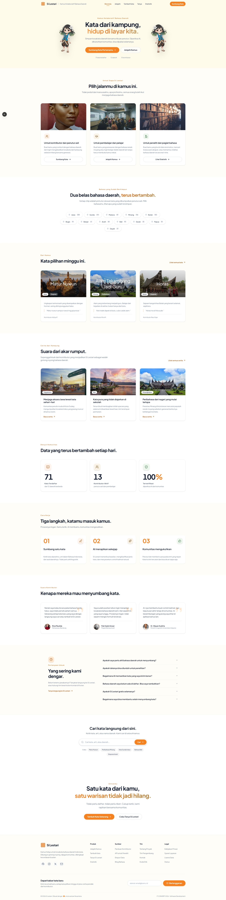
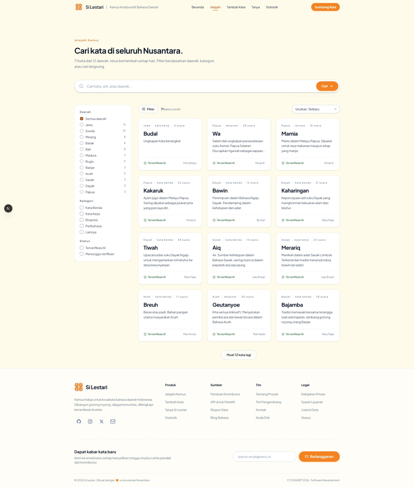
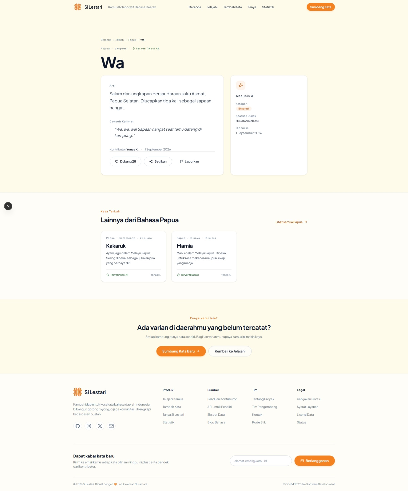
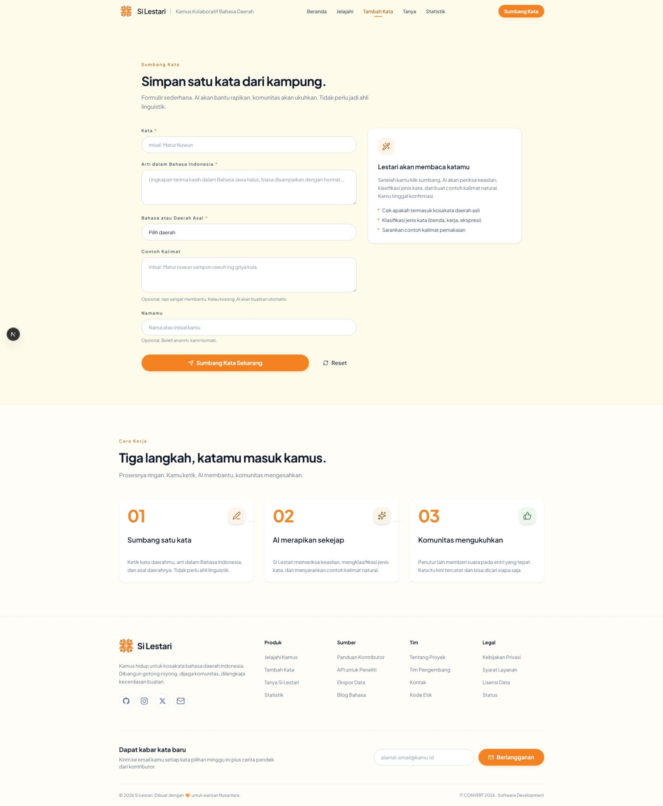
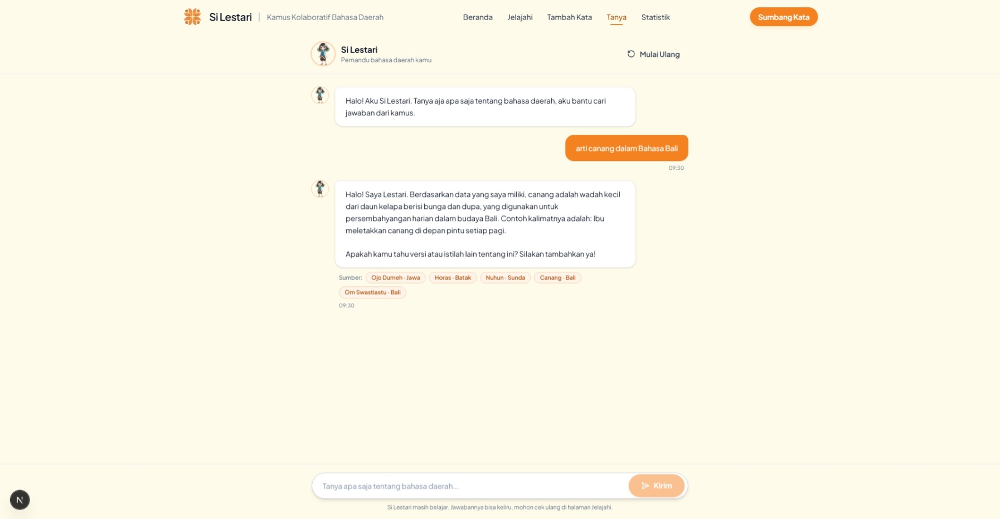
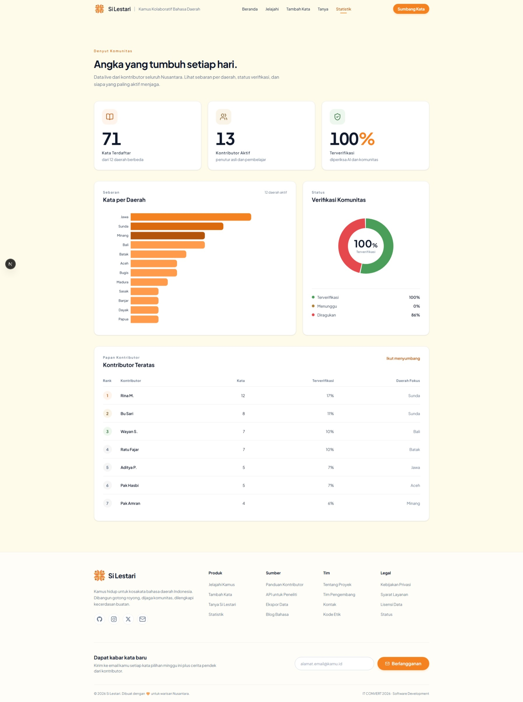

<div align="center">


# Si Lestari

**Platform Kolaboratif Pelestarian Kosakata Bahasa Daerah Indonesia berbasis AI**

*Sumbangkan katamu, AI memvalidasi, komunitas mengukuhkan. Semuanya menjadi kamus hidup.*


Karya untuk kompetisi **IT CONVERT 2026 · Software Development**
Subtema: *AI for Society and Culture* · Himpunan Mahasiswa Sistem Informasi UNEJ

</div>

> ⚡ **Mau langsung menjalankan?** Lihat bagian [Cara Menjalankan](#️-cara-menjalankan)
> di bawah. Ringkasnya: jalankan PocketBase (`pocketbase serve`) terlebih dahulu,
> lalu `npm run dev` di `apps/web`. Jika muncul error `HTTP 502`, itu tanda backend
> PocketBase belum berjalan.

---

## 📖 Tentang Proyek

Indonesia memiliki **718 bahasa daerah**, tetapi baru sekitar **10–15%** yang pernah
dikaji vitalitasnya. Dokumentasi bergantung pada ahli yang terbatas, kamus digital
yang ada bersifat statis dan satu arah, sementara generasi muda makin jauh dari
bahasa ibunya.

**Si Lestari** menjawabnya dengan pendekatan gotong royong: siapa pun dapat
menyumbang kosakata daerah, lalu **AI Google Gemini** otomatis memvalidasi
keaslian kata, mengklasifikasi kategori, dan melengkapi contoh kalimat. Komunitas
mengukuhkan lewat mekanisme upvote. Sebuah chatbot bernama **Tanya Si Lestari**
membantu pengguna belajar dengan menjawab pertanyaan langsung dari data kamus
yang terkumpul (Retrieval Augmented Generation).

> Bukan kamus statis satu arah. Si Lestari adalah **kamus hidup** yang tumbuh
> bersama penuturnya.

---

## ✨ Fitur

| Fitur | Deskripsi |
|---|---|
| 🖊️ **Sumbang Kata** | Formulir cepat (≤60 detik): kata, arti, daerah, contoh kalimat opsional, kontributor boleh anonim |
| 🤖 **Validasi AI Otomatis** | Gemini memeriksa keaslian kosakata, menentukan kategori, dan meng-generate contoh kalimat, berjalan async tanpa memblokir pengguna |
| 🗺️ **Jelajahi & Cari** | Filter 12 daerah, kategori, status verifikasi; pencarian lintas kolom; 4 mode pengurutan |
| 📄 **Detail Kata** | Arti lengkap, contoh, catatan AI, kata terkait satu daerah, tombol dukung & bagikan |
| ❤️ **Verifikasi Komunitas** | Upvote publik yang tersimpan aman lewat endpoint server-side |
| 💬 **Tanya Si Lestari (RAG)** | Chatbot yang menjawab dari entri kamus asli, lengkap dengan sumber yang bisa diklik |
| 📊 **Statistik Komunitas** | KPI, sebaran per daerah, status verifikasi, dan papan kontributor, semua real-time dari database |

---


> Letakkan screenshot di folder `.github/assets/` dengan nama file sesuai di bawah,
> lalu hapus baris catatan miring ini.

### Beranda (Landing)




### Jelajahi Kamus: filter & pencarian




### Detail Kata




### Sumbang Kata + Validasi AI




### Tanya Si Lestari: Chatbot RAG




### Statistik Komunitas




---

## 🛠️ Tech Stack

| Lapisan | Teknologi | Keterangan |
|---|---|---|
| Frontend | [Next.js 16](https://nextjs.org) (App Router) + React 19 + TypeScript | Server & client components |
| Styling | Tailwind CSS 4 + design system kustom | Palet hangat: cream, kilau orange, batik gold, daun hijau |
| Backend & DB | [PocketBase](https://pocketbase.io) (SQLite) | REST API + Admin UI dalam satu binary |
| AI | [Google Gemini API](https://ai.google.dev) | Validasi entri + chatbot RAG, berjalan server-side |
| Chart | Recharts | Visualisasi statistik |
| Hosting | Vercel (frontend) + self-host / PaaS (PocketBase) | Seluruhnya di atas free tier |

### Arsitektur

```
┌────────────┐   interaksi    ┌──────────────────┐   baca/tulis    ┌──────────────────┐
│  Pengguna  │ ─────────────► │  Aplikasi Web    │ ──────────────► │  PocketBase      │
│ (browser)  │ ◄───────────── │  Next.js         │ ◄────────────── │  (SQLite)        │
└────────────┘                └────────┬─────────┘                 └──────────────────┘
                                       │ panggil AI (server-side only)
                                       ▼
                              ┌──────────────────┐
                              │  Google Gemini   │
                              │  API             │
                              └──────────────────┘
```

Semua panggilan ke Gemini **wajib** melewati API route Next.js (server-side)
agar API key tidak pernah terekspos ke browser.

---

## 🚀 Cara Menjalankan

### Prasyarat

- Node.js ≥ 20
- [PocketBase v0.40+](https://github.com/pocketbase/pocketbase/releases)
  (unduh binary sesuai OS Anda)
- API key Gemini gratis dari [Google AI Studio](https://aistudio.google.com/apikey)

### 1. Clone & install

```bash
git clone https://github.com/vitoaditya/SiLestari.git
cd SiLestari/apps/web
npm install
```

### 2. Siapkan PocketBase

```bash
# letakkan binary pocketbase di folder apps/pocketbase, lalu:
cd ../pocketbase
./pocketbase serve --http=127.0.0.1:8090
```

### 3. Konfigurasi environment

```bash
cd ../web
cp .env.local.example .env.local
# isi: NEXT_PUBLIC_POCKETBASE_URL, POCKETBASE_ADMIN_EMAIL,
#       POCKETBASE_ADMIN_PASSWORD, GEMINI_API_KEY
```

### 4. Buat collection & seed data (otomatis)

```bash
npm run pb:setup           # membuat collection entries + chat_logs, index, API rules
npm run seed               # mengisi 70 kosakata dari 12 daerah (idempotent)
npm run ai:validate-pending  # opsional: validasi AI untuk entri yang belum diperiksa
```

### 5. Jalankan

```bash
npm run dev
# buka http://localhost:3000
```

---

## 📜 Script

| Perintah | Fungsi |
|---|---|
| `npm run dev` | Menjalankan aplikasi dalam mode development |
| `npm run build` | Build produksi |
| `npm run pb:setup` | Membuat collection + index + API rules secara idempotent |
| `npm run seed` | Menambah entri kosakata dari `scripts/seed-data.json` (skip yang sudah ada) |
| `npm run ai:validate-pending` | Backfill validasi AI untuk entri berstatus menunggu |

## 🔌 API

| Endpoint | Method | Fungsi |
|---|---|---|
| `/api/entries` | GET | Daftar entri, filter `daerah`, `kategori`, `status`, pencarian `q`, `sort` |
| `/api/entries` | POST | Buat entri baru + trigger validasi AI (fire-and-forget) |
| `/api/entries/[id]` | GET | Detail satu entri |
| `/api/entries/[id]/upvote` | POST | Tambah dukungan komunitas (via admin token) |
| `/api/validate` | POST | Analisis entri oleh Gemini, update hasil ke database |
| `/api/chat` | POST | Chatbot RAG: retrieval PocketBase → jawaban Gemini + sumber |
| `/api/stats` | GET | Agregasi statistik komunitas |

## 🔑 Environment Variables

| Variabel | Wajib | Keterangan |
|---|---|---|
| `NEXT_PUBLIC_POCKETBASE_URL` | ✓ | URL PocketBase, mis. `http://127.0.0.1:8090` |
| `POCKETBASE_ADMIN_EMAIL` | ✓ | Superuser PocketBase (server-side only) |
| `POCKETBASE_ADMIN_PASSWORD` | ✓ | Password superuser |
| `GEMINI_API_KEY` | ✓ | API key Google AI Studio |
| `GEMINI_MODEL` | — | Default `gemini-3.6-flash` |
| `GEMINI_MODEL_CHAT` | — | Model khusus chat (pisah kuota harian) |
| `GEMINI_MODEL_FALLBACKS` | — | Daftar model cadangan dipisah koma |

## 📁 Struktur Proyek

```
SiLestari/
├─ apps/
│  ├─ web/                     # Aplikasi Next.js
│  │  ├─ app/                  # Halaman + API routes
│  │  │  ├─ page.tsx           # Beranda
│  │  │  ├─ jelajahi/          # Jelajahi kamus
│  │  │  ├─ kamus/[id]/        # Detail kata
│  │  │  ├─ tambah/            # Sumbang kata + panel AI
│  │  │  ├─ tanya/             # Chatbot RAG
│  │  │  ├─ statistik/         # Dashboard statistik
│  │  │  └─ api/               # entries, validate, chat, stats
│  │  ├─ components/           # landing, jelajahi, kamus, tambah, tanya, statistik, ui
│  │  ├─ lib/                  # pocketbase, gemini, prompts, stats, ratelimit
│  │  └─ scripts/              # setup-pocketbase, seed, validate-pending
│  └─ pocketbase/              # Binary + data PocketBase (lokal, di-gitignore)
└─ README.md
```

## 🗺️ Status & Rencana Pengembangan

**MVP (selesai):** semua fitur inti berfungsi end-to-end, dari submit, validasi
AI, tampil di kamus, chatbot RAG, hingga statistik real-time.

**Rencana berikutnya:**
- [ ] Autentikasi kontributor (v1.1): atribusi otomatis & riwayat kontribusi
- [ ] Unggah audio pelafalan + pemutar di detail kata
- [ ] Panel moderasi untuk entri meragukan
- [ ] Ekspor open data (CSV/JSON) untuk peneliti

## 👥 Tim

| Peran | Nama |
|---|---|
| Ketua | Vito Aditya |
| Anggota 1 | Muhammad Rizki Ibrahim |

## 📄 Lisensi

Karya ini dikembangkan untuk keperluan kompetisi IT CONVERT 2026.
Hak cipta atas kode dan aset dimiliki oleh tim.
